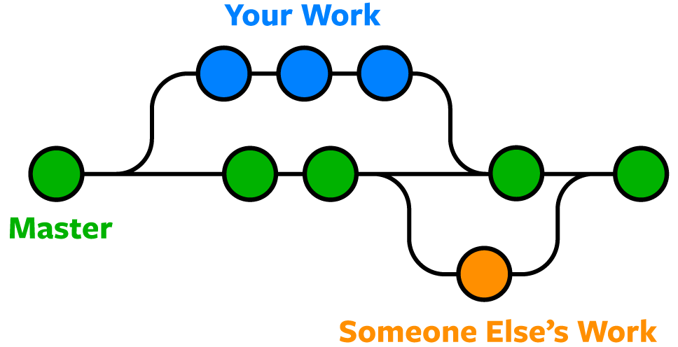

# Git 기초 튜토리얼

처음 Git을 사용하는 팀원을 위한 빠른 시작 가이드입니다.

---

## 참고 자료
- [Git 웹사이트](https://git-scm.com/)

**직접 실습할 수 있는 사이트**
- [Git 인터랙티브 튜토리얼](https://violet-bora-lee.github.io/git-tutorial/)

**유튜브 강의 (코딩애플)** — 초기 설정은 강의 1을 먼저 보세요

| Git 1 — add, commit 기초 | Git 2 — VSCode에서 사용하기 | Git 3 — branch 활용 |
|:---:|:---:|:---:|
| [](https://www.youtube.com/watch?v=sly2u8BIi9E) | [](https://www.youtube.com/watch?v=xD9GnHKveRk) | [](https://www.youtube.com/watch?v=XFm2qNs30BE) |

---

## Git이란?

Git은 리눅스의 창시자 Linus Torvalds가 개발한 **버전 관리 시스템**입니다. 파일의 변경 이력을 저장해 언제든지 이전 상태로 돌아갈 수 있고, 여러 명이 동시에 작업할 수 있게 해줍니다.

### 파일의 세 단계

```
Working Directory  →  Staging Area  →  Repository
   (수정 중)           (git add)        (git commit)
```

| 단계 | 설명 |
|---|---|
| **Working Directory** | 내가 직접 편집 중인 파일들 |
| **Staging Area** | `git add`로 커밋에 포함할 파일을 선택한 상태 |
| **Repository** | `git commit`으로 저장된 커밋들의 역사 |

### Local vs Origin (원격 저장소)

Git에는 두 곳에 코드가 존재합니다.

| | 위치 | 설명 |
|---|---|---|
| **local** | 내 컴퓨터 | 내가 직접 수정하는 곳 |
| **origin** | GitHub 서버 | 팀원 모두가 공유하는 복사본 |

> origin은 GitHub에 있는 "공식 복사본"이라고 생각하면 됩니다.  
> 내 컴퓨터에서 작업한 것을 origin에 올려야 팀원이 볼 수 있고, origin의 변경사항을 내려받아야 내가 최신 코드를 볼 수 있습니다.

---

## 초기 설정

> Git 설치 및 계정 연결은 **[코딩애플 강의 1](https://www.youtube.com/watch?v=sly2u8BIi9E)** 을 참고하세요.
> **팁** — 원하는 위치에서 터미널을 열려면: 파일 탐색기에서 해당 폴더를 열고 → 빈 곳에서 **우클릭** → **터미널에서 열기**

**1. Git 설치** — 아래 중 하나로 설치

```bash
winget install Git.Git        # 윈도우 터미널에서 실행 (권장)
```

또는 [git-scm.com](https://git-scm.com/)에서 직접 다운로드

**2. 터미널 재시작** — 설치 후 VSCode 터미널을 완전히 닫았다가 다시 열어야 git 명령어가 인식됩니다.

**3. 계정 등록** (터미널에 한 번만 입력):

```bash
git config --global user.name "hong-gildong"
git config --global user.email "abc@example.com"
```

**4. 저장소 복제** (처음 한 번만) — 터미널이 열려 있는 폴더 안에 레포지토리가 복사됩니다.


```bash
git clone https://github.com/org/repo-name.git
```

---

## 기본 명령어

| 명령어 | 역할 |
|---|---|
| `git clone` | 원격 저장소를 내 컴퓨터에 복제 |
| `git status` | 현재 변경 사항 확인 |
| `git log` | 커밋 기록 확인 |
| `git fetch` | origin의 변경 내역 확인 (내려받지는 않음) |
| `git pull` | origin의 변경 내역을 내려받고 합치기 |
| `git add` | 커밋할 파일 선택 (staging) |
| `git commit` | 선택한 파일을 커밋으로 기록 |
| `git push` | 내 커밋을 origin에 올리기 |

---

## 상황별 코드

### 1. 작업 시작 전 필수 — 동기화

이 단계를 건너뛰면 충돌이 날 확률이 매우 높습니다. (각자 개인 폴더 안에서만 작업한다면 충돌이 나지 않지만, 공유 파일을 건드릴 경우엔 반드시 먼저 동기화하세요.)

> **fetch 먼저, pull은 신중하게.**
> `pull`은 자동으로 합치기 때문에 충돌이 날 수 있습니다. fetch로 먼저 확인하는 습관을 들이세요.

```bash
git fetch origin        # origin의 변경 내역 확인 (내 코드는 그대로)
git status              # 얼마나 뒤처졌는지 확인
git pull origin main    # 문제 없으면 내려받기
```

### 2. 커밋하고 올리기

**처음이라면 — 개인 폴더 먼저 만들기:**

빈 폴더는 커밋할 수 없으므로 폴더 생성 후 파일을 하나 만들어 첫 커밋까지 합니다.

```bash
mkdir hong-gildong              # 개인 폴더 생성 (영어 이름 사용)
cd hong-gildong                 # 폴더로 이동
# VSCode에서 hong_gildong.py 파일 만들고 저장
```

**커밋 & 푸시:**


```bash
git add .                       # 현재 폴더(.)에서 모든 변경사항 올리기
git commit -m "initial commit"  # 커밋 메세지는 필수사항
git push origin main            # git push 만 적어도 됨
```

이후 작업은 이 폴더 안에서만 하고, 완성된 결과물을 main 폴더에 올립니다.

### 3. 충돌(conflict) 해결과 Pull Request


두 사람이 같은 파일의 같은 줄을 수정하면 충돌이 나게 됩니다.

**충돌 해결:**

```bash
git pull origin main            # pull — 파일에 충돌 표시가 생김
# 충돌 파일을 열어 직접 수정 후:
git add conflicting_file.py
git commit -m "resolve merge conflict"
git push origin main
```

> **참고** — 파일을 열면 충돌 부분이 아래처럼 표시됩니다. 원하는 내용만 남기고 나머지(`<<<<`, `====`, `>>>>` 포함)는 지우세요.
> ```
> <<<<<<< HEAD
>   내 코드
> =======
>   팀원 코드
> >>>>>>> origin/main
> ```

**Pull Request가 필요한 상황:**

브랜치에서 작업을 마치고 main에 합칠 때, 명령어로 직접 merge하면 충돌 위험이 높고 팀원이 확인하기 어렵습니다.  
이럴 때 GitHub에서 **Pull Request(PR)** 를 사용합니다.

- 브랜치 작업을 마치고 main에 합칠 때
- 팀원의 코드 리뷰가 필요할 때
- 변경 이력과 승인 기록을 남겨야 할 때

브랜치를 main에 합치는 작업은 충돌 가능성이 높고 기록·권한 관리가 필요하므로, **명령어 대신 GitHub 사이트에서** 진행합니다.

---

## 브랜치(Branch)

### 개념 — 나무처럼 자라는 역사

```
main:        A ── B ── C ── D        <- trunk (main branch)
                       \
hong-gildong:           E ── F       <- branch (personal branch)
```

- **commit** : 저장된 코드의 기록 하나. 나무의 마디처럼 쌓여 역사가 됩니다.
- **branch** : 줄기에서 뻗어나온 가지. 개인 작업이나 실험적인 작업을 따로 진행할 때 씁니다.
- 가지에서 작업을 마치면 줄기(main)에 **merge** 해서 합칩니다.

### 브랜치 만들고 올리기



```bash
git branch hong-gildong         # create a branch (use your English name)
git checkout hong-gildong       # switch to that branch
# git checkout -b hong-gildong 으로 한번에 가능
# ... work, add, commit ...
git push origin hong-gildong    # push the branch to origin
```

### GitHub에서 Pull Request 열기

1. GitHub 저장소 페이지 → **Compare & pull request** 클릭
2. 변경 내용 확인 후 **Create pull request**
3. 팀원 리뷰 → **Merge pull request**

> 브랜치를 main에 합치는 작업은 항상 GitHub 사이트에서 PR로 진행하세요.

### 기타 브랜치 명령어

| 명령어 | 역할 |
|---|---|
| `git branch` | 브랜치 목록 확인 |
| `git checkout` | 브랜치 이동 또는 파일 되돌리기 |
| `git merge` | 브랜치를 현재 브랜치에 합치기 |
| `git rebase` | 커밋 역사를 깔끔하게 재정렬 (주의해서 사용) |
