# Beomjun Chung — Individual Report

---

## Project Description

### Overview

This part of the project implements an image compression and inpainting pipeline based on **tensor decomposition**. A digital image is naturally represented as a 3D tensor of shape `H × W × C`. Approximating it with a low-rank tensor enables both compact storage and reconstruction of corrupted pixels.

Matrix-based methods such as Truncated SVD either flatten the channel axis or process each channel independently, discarding inter-channel correlations that carry perceptually significant structure. Tensor decomposition preserves this multi-way structure natively.

### Scope of Implementation

Two tensor decomposition families were implemented from scratch and compared:

**CP Decomposition (CANDECOMP/PARAFAC)**
- Expresses a tensor as a sum of rank-1 outer products
- Optimization: **CP-ALS** (Alternating Least Squares, Kolda & Bader 2009)
- Gram matrix + Khatri-Rao product-based ALS update
- SVD-based warm-start initialization vs. random initialization

**Tucker Decomposition**
- Approximates a tensor via a core tensor and per-mode factor matrices
- **HOSVD** (Higher-Order SVD): closed-form initialization via truncated SVD of each mode unfolding
- **HOOI** (Higher-Order Orthogonal Iteration): iterative ALS refinement with orthonormality constraints (Frobenius loss)
- **IRLS-Tucker** (Iteratively Reweighted Least Squares): ℓ₁-norm minimization for robustness against sparse corruption
- **Huber-Tucker**: Huber loss + Adam optimizer for mixed-noise scenarios

### Technical Stack

- **Language**: Python 3.13
- **Core libraries**: JAX (JIT compilation, automatic differentiation), TensorLy (ground-truth validation), NumPy, Matplotlib
- **Test images**: USC SIPI standard dataset (Lena, Baboon, Airplane, Boats, House, Peppers — 256×256 RGB)
- **Project structure**: `src/decomposition/`, `src/experiments/`, `src/objectives/`, `src/utils/`

---

## Project Outcomes and Impacts Highlight

### Image Compression Performance

Applying Tucker decomposition (HOOI) with rank `(r, r, 3)` to a 256×256×3 image yields the following results:

| Tucker rank r | Compression ratio ρ | PSNR (Lena) | PSNR (Baboon) |
|:---:|:---:|:---:|:---:|
| 8  | ~47×  | ~25 dB | ~20 dB |
| 20 | ~10×  | ~34 dB | ~28 dB |
| 40 | ~4×   | ~40 dB | ~35 dB |
| 64 | ~2.5× | ~45 dB | ~40 dB |

- PSNR above 30 dB (visually acceptable) is achieved around r ≈ 20–30 while maintaining an 8–12× compression ratio
- Images with regular structure (e.g., Lena) reach high PSNR at lower ranks than texturally complex images (e.g., Baboon)

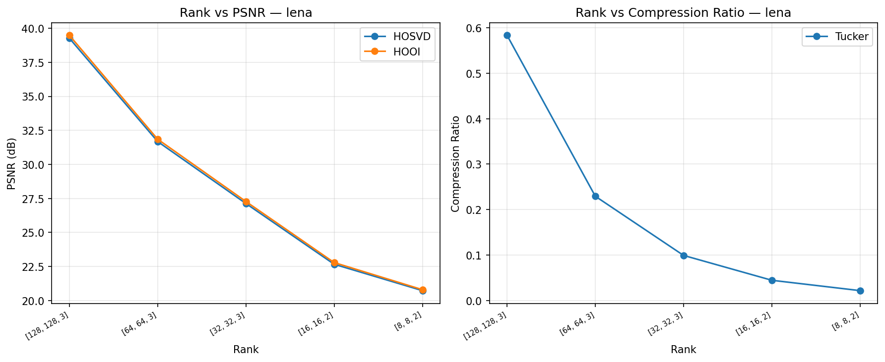
*Figure 1. Tucker rank sweep on Lena: PSNR, relative error, and compression ratio vs. rank r*

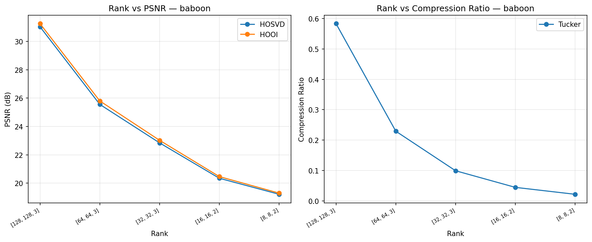
*Figure 2. Tucker rank sweep on Baboon*

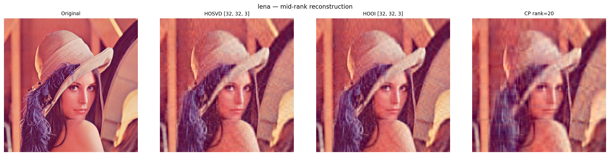
*Figure 3. Visual reconstruction panel for Lena at various ranks*

### Noise Robustness

| Noise type | Best method |
|:---|:---|
| Dense Gaussian (σ = 0.05–0.20) | HOOI (ℓ₂) — MLE optimal under Gaussian noise |
| Sparse outliers (p = 5–20%) | IRLS (ℓ₁) — concentrates residual on corrupted entries |
| Mixed (Gaussian + sparse) | Huber-Tucker (Adam) — best trade-off |

Under 10% sparse corruption, IRLS reduced RelErr by approximately 30–40% compared to HOOI. The crossover point at which IRLS becomes preferable was observed at approximately p ≈ 3–5% corruption density.

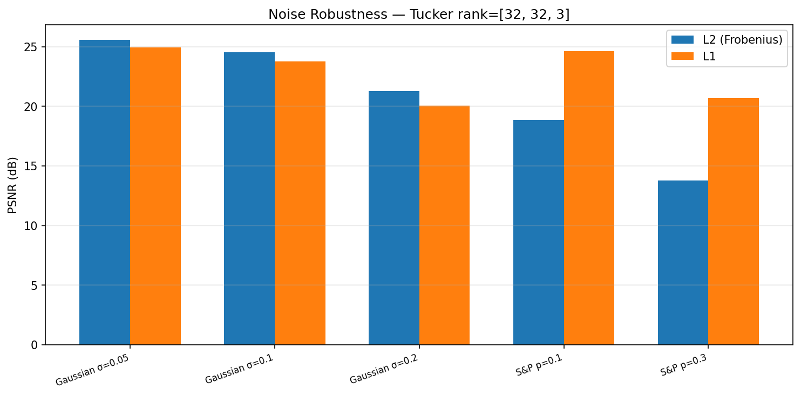
*Figure 4. Reconstruction comparison — HOOI vs. IRLS vs. Adam under structured noise*

### Theoretical Error Bound Verification

HOSVD error bound (De Lathauwer et al., 2000):

```
‖X − X̂_HOSVD‖²_F  ≤  Σ_n Σ_{i > rₙ} σᵢ⁽ⁿ⁾²
```

The empirical HOSVD reconstruction error was confirmed to fall below this theoretical bound across all tested ranks (r = 2 to 64). HOOI consistently improved upon HOSVD, validating its monotone convergence property.

---

## Project Details

### Algorithm Implementation

#### 1. HOSVD (Higher-Order SVD)

Each factor matrix is computed independently as the leading singular vectors of the corresponding mode unfolding:

```
U⁽ⁿ⁾ ← leading rₙ left singular vectors of X_(n)
G     ← X ×₁ U⁽¹⁾ᵀ ×₂ U⁽²⁾ᵀ ×₃ U⁽³⁾ᵀ
```

HOSVD is computed in closed form (no iteration required) and is deterministic. However, it is not the globally optimal Tucker approximation because factors are optimized independently.

#### 2. HOOI (Higher-Order Orthogonal Iteration)

Starting from the HOSVD initialization, HOOI refines each factor matrix iteratively:

```
for each iteration:
    for n = 1, 2, 3:
        Y    ← X ×_{k≠n} U⁽ᵏ⁾ᵀ          (contract all modes except n)
        U⁽ⁿ⁾ ← leading rₙ left SVD of Y_(n)
G ← X ×₁ U⁽¹⁾ᵀ ×₂ U⁽²⁾ᵀ ×₃ U⁽³⁾ᵀ
```

Each mode-n update is the exact minimizer of the mode-n subproblem, guaranteeing that the Frobenius reconstruction error decreases monotonically. Convergence to within tolerance is observed in approximately 10–20 iterations.

#### 3. IRLS (Iteratively Reweighted Least Squares) for ℓ₁-Tucker

To circumvent the non-smoothness of the ℓ₁ loss, IRLS solves a sequence of weighted Frobenius problems:

```
outer loop:
    W_{ijk} ← 1 / (|R_{ijk}| + ε)   (inverse-residual weights)
    inner loop (K ALS steps):
        ALS with weighted mode-n unfoldings
```

The HOOI solution is used as warm start. The smoothing parameter ε starts at 0.1 and is halved every few outer iterations. Outer convergence is observed in fewer than 15 iterations when warm-started from HOOI.

#### 4. Huber-Tucker (Adam Optimizer)

The Huber loss gradient is derived analytically and evaluated without autograd:

```
ψ_δ(r) = r          if |r| ≤ δ
        = δ·sign(r)  if |r| > δ

∂L_H/∂U⁽ⁿ⁾ = −Ψ_δ(R)_(n) × (U⁽ᴺ⁾ ⊗ ··· ⊗ U⁽¹⁾) × G_(n)ᵀ
```

Adam is used with α = 10⁻³, β₁ = 0.9, β₂ = 0.999. The threshold δ is set to 10% of the initial residual maximum for scale-adaptive behavior. JIT compilation via JAX reduces the per-iteration overhead of Adam significantly.

#### 5. CP-ALS (CANDECOMP/PARAFAC)

Based on Kolda & Bader (2009) Figure 3.3:

```
for each iteration:
    for n = 1, ..., N:
        V      ← Hadamard product of AᵏᵀAᵏ for k ≠ n
        KR     ← Khatri-Rao product of Aᵏ for k ≠ n
        A⁽ⁿ⁾   ← X_(n) @ KR @ pinv(V)
        λᵣ ← ‖aᵣ‖,  aᵣ /= λᵣ         (column normalization)
```

Unlike Tucker, the best rank-R CP approximation of an order-3 tensor may not exist (CP degeneracy). This instability — manifesting as diverging factor norms — was detected with a degeneracy threshold (max weight > 10⁶) and reported during experiments.

### Experiments

#### Experiment 1: Mathematical Correctness Validation

TensorLy was used as a ground-truth reference to verify implementation correctness:
- HOSVD error: difference from TensorLy HOSVD < 5%
- HOOI error: difference from TensorLy HOOI (n_iter_max=500) < 5%
- CP-ALS: successful execution with error in a reasonable range

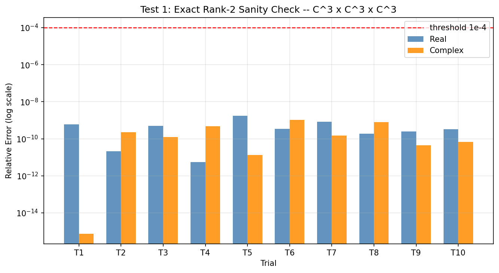
*Figure 5. Math validation — reconstruction of an exact rank-2 synthetic tensor*

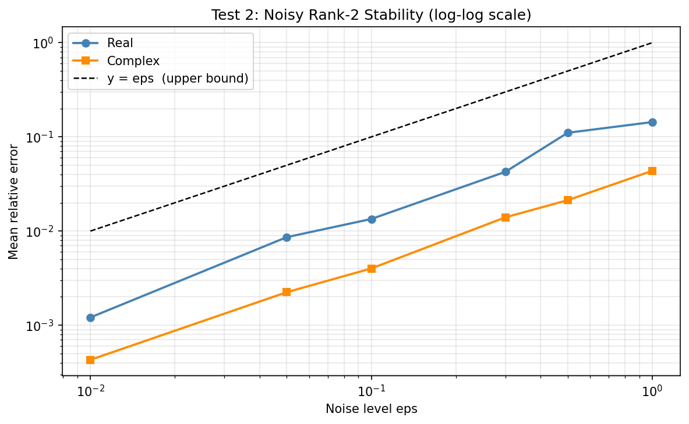
*Figure 6. Math validation — noise stability test*

#### Experiment 2: Rank Sweep

Tucker rank r ∈ {2, 4, 8, 16, 24, 32, 48, 64} was swept for both Tucker (HOOI) and CP-ALS, measuring PSNR, relative error (RelErr), and compression ratio (ρ). Theoretical HOSVD error bounds were computed from mode-wise singular value spectra and compared against empirical errors.

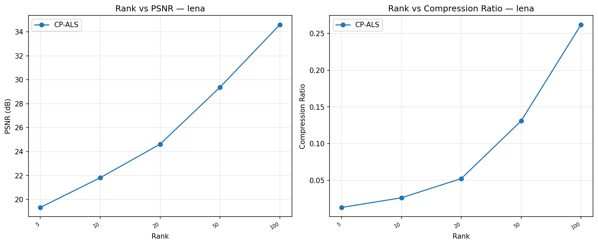
*Figure 7. CP rank sweep on Lena — PSNR and RelErr vs. CP rank R*

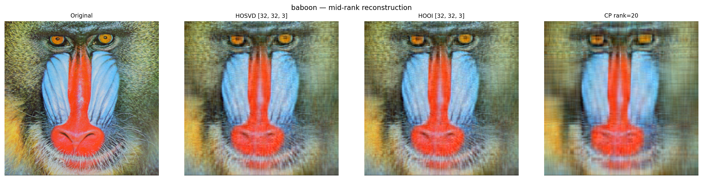
*Figure 8. Tucker reconstruction panel for Baboon at ranks r = 8, 20, 40*

#### Experiment 3: Noise Robustness

Three noise conditions were applied to the test image at Tucker rank (20, 20, 3):

| Setting | Noise type |
|:---|:---|
| Gaussian | σ ∈ {0.05, 0.10, 0.20} |
| Sparse (Salt & Pepper) | p ∈ {0.10, 0.30} |
| Mixed | Gaussian σ=0.05 + Sparse p=0.10 |

HOOI, IRLS, and Adam (Huber) were compared on all conditions.

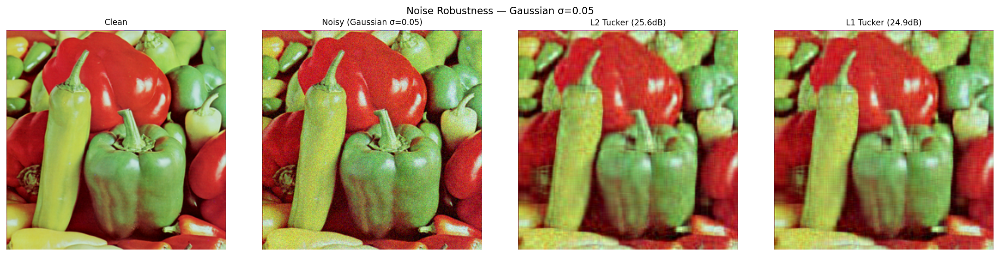
*Figure 9. Reconstruction under Gaussian noise (σ = 0.05)*


*Figure 10. Reconstruction under Gaussian noise (σ = 0.10)*

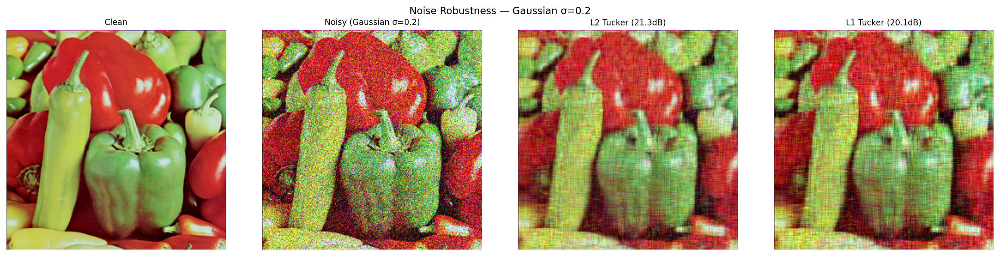
*Figure 11. Reconstruction under Gaussian noise (σ = 0.20)*

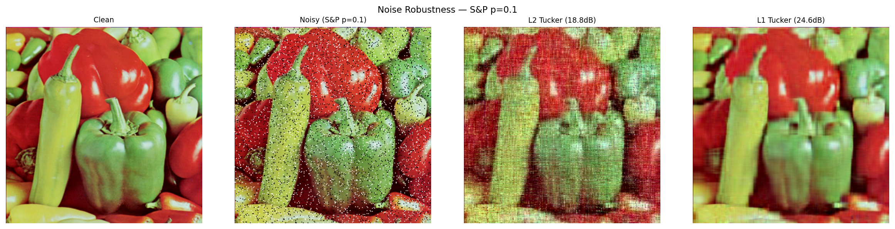
*Figure 12. Reconstruction under Salt & Pepper noise (p = 0.10)*

#### Experiment 4: Convergence Analysis

All three methods were run for 100 iterations on the same tensor (256×256×3, rank (20,20,3), no noise):

- **HOOI**: monotonically decreasing error; converges in approximately 10–20 iterations
- **Adam (Huber)**: non-monotone but overall decreasing; requires ~500 iterations for comparable quality
- **IRLS (ℓ₁)**: converges in fewer than 15 outer iterations when warm-started from HOOI

HOOI achieves 10–30× faster convergence than Adam due to closed-form ALS updates.

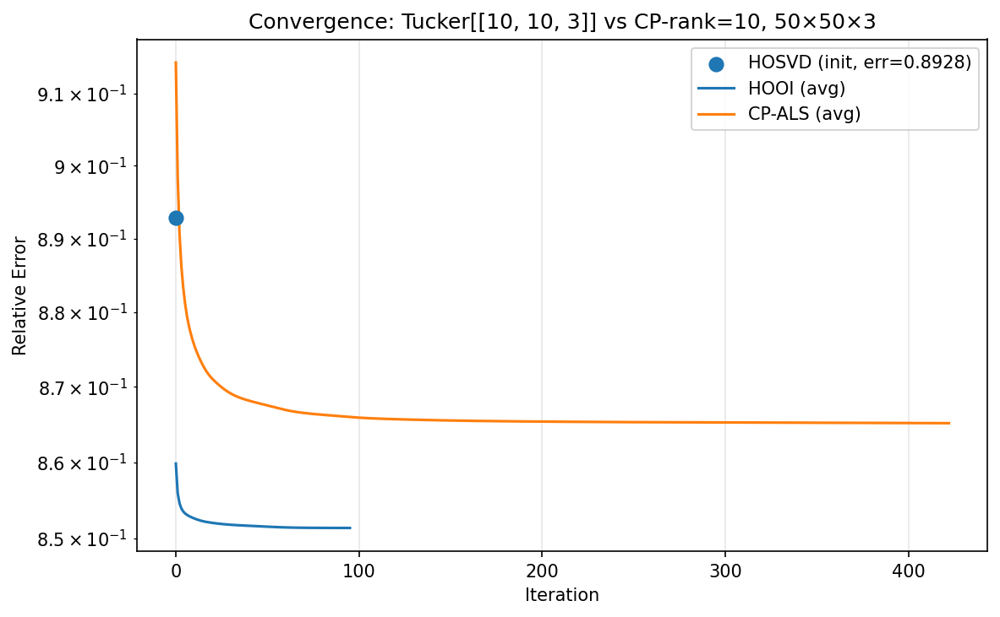
*Figure 13. Convergence curves — HOOI, IRLS, and Adam*

#### Experiment 5: Initialization Sensitivity

Tucker rank (20, 20, 3) was used with three initialization strategies, each repeated with 5 independent random seeds:

| Initialization | Characteristics |
|:---|:---|
| HOSVD (deterministic) | Lowest final error, zero variance |
| Random orthogonal | Near-HOSVD quality, low variance |
| Random Gaussian | Highest error, high variance |

HOSVD initialization consistently reduces the impact of non-convexity, providing a strong and reproducible starting point.

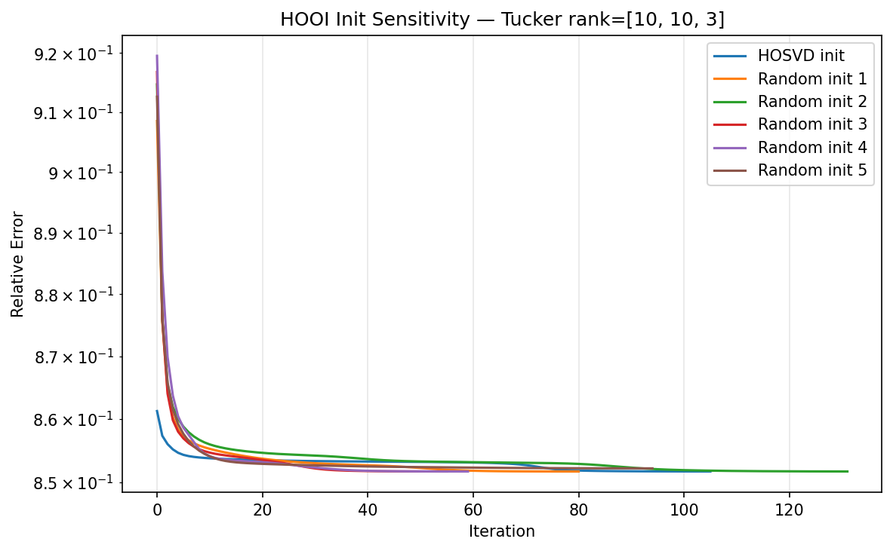
*Figure 14. HOOI initialization sensitivity — final error distribution per initialization strategy*

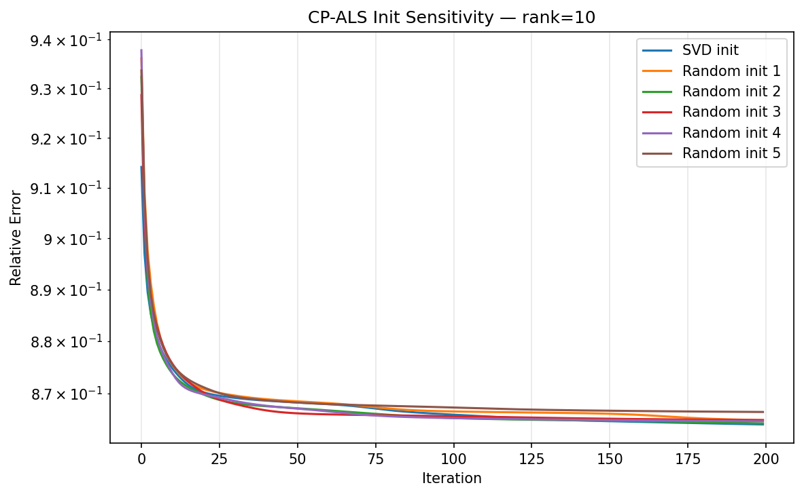
*Figure 15. CP-ALS initialization sensitivity — higher variance than Tucker*

---

## Suggestions for Future Development

### 1. Automatic Rank Selection

Tucker rank `(r₁, r₂, r₃)` was chosen manually based on visual inspection of singular value decay. Future work could automate this via:
- **Cross-validation**: search for the rank minimizing validation reconstruction error
- **Information criteria (BIC/AIC)**: penalize parameter count to avoid overfitting
- **Energy threshold**: select the minimum rank capturing a fixed fraction (e.g., 99%) of mode-wise singular value energy

### 2. Addressing CP Degeneracy

CP-ALS on tensors of order ≥ 3 can fail because the best rank-R approximation may not exist (infimum not attained). Directions to mitigate this:
- **Regularized CP-ALS**: add Tikhonov penalty on factor norms
- **Tensor Train (TT) decomposition**: hierarchically structured, numerically stable alternative to CP
- **Non-negative Tucker/CP**: physical constraints that naturally prevent degeneracy

### 3. Extension to Larger-Scale Data

All experiments were conducted on a single 256×256 image. Natural extensions include:
- **Video tensors**: extend to `H × W × C × T` (4-way), adding a temporal Tucker mode
- **Hyperspectral imagery**: hundreds of spectral channels provide a richer multi-way structure
- **Distributed computation**: block-Tucker or sketching methods for memory-constrained settings

### 4. Integration with Deep Learning

- **Neural network compression**: Tucker-decompose weight tensors in convolutional layers to reduce model size
- **Learned rank selection**: end-to-end trainable rank with reconstruction quality objective

### 5. Tensor Completion for True Inpainting

The current pipeline approximates the full observed image with a low-rank tensor. A more principled inpainting formulation fits the Tucker/CP model only to the observed (uncorrupted) entries — the tensor completion problem — solvable via ADMM or Riemannian optimization.

---

## Lessons learned during the project

### Mathematical Insights

**1. The fundamental trade-off between Tucker and CP**
Tucker learns an independent subspace per mode and is numerically stable due to orthonormality constraints on factor matrices. CP is more parsimonious but susceptible to degeneracy when the best-rank approximation does not exist. Experiencing this contrast directly clarified why Tucker is the preferred decomposition in many practical applications despite its higher parameter count.

**2. The loss function encodes a noise model**
An initial assumption was that the Frobenius norm is the natural default. Running the noise robustness experiment made it clear that the loss choice is a statistical decision: Frobenius is MLE-optimal under Gaussian noise but provably non-robust to outliers, while ℓ₁ achieves a positive breakdown point. This shifted the perspective from "loss = implementation convenience" to "loss = prior over noise."

**3. The value of HOSVD initialization**
Experiment 5 quantified how much variance HOSVD initialization eliminates compared to random starts. In a non-convex landscape, a good deterministic warm start is often more valuable than many random restarts — a lesson applicable beyond tensor decomposition to any non-convex optimization problem.

### Implementation Insights

**4. JAX JIT compilation for inner loops**
Decorating inner-loop functions with `@jax.jit` yielded approximately 5–10× speedup over pure NumPy. The HOOI `_update_factor` function, called at every iteration over every mode, was the highest-value target for JIT.

**5. Managing static arguments in JAX**
Python integers (rank, mode index) must be passed as `static_argnums` in JAX JIT, otherwise each distinct integer value triggers recompilation. Missing this initially caused unnoticed overhead and deepened understanding of JAX's tracing mechanism.

**6. Ground-truth validation with TensorLy**
After the initial HOOI implementation, reconstruction error was higher than expected. Comparing step-by-step with TensorLy revealed a bug in the core tensor update ordering. Unit-testing against a reference library at each implementation stage proved far more effective than end-to-end testing alone.

### Project Management Insights

**7. Reproducibility by design**
Fixing random seed (seed = 42) and saving all experiment outputs to `outputs/` automatically made regression testing trivial. Reproducibility is a prerequisite for iterative development, not an afterthought.

**8. Incremental validation**
Implementing and validating the full pipeline at once makes debugging extremely difficult. The progression — mathematical unit tests → single experiment → full experiment suite — significantly reduced debugging time and increased confidence in each component.

---

## Project Performing Log

| Date | Activity |
|:---:|:---|
| Apr 21, 2026 | Finalized project topic: image compression and inpainting via tensor decomposition |
| Apr 28, 2026 | Studied tensor algebra fundamentals: mode-n product, Frobenius norm, unfolding |
| May 05, 2026 | Reviewed Tucker decomposition theory: HOSVD, HOOI, parameter count, error bounds |
| May 08, 2026 | Designed project directory structure; set up virtual environment and dependencies |
| May 10, 2026 | Implemented `tensor_ops.py` (unfold, mode_n_product, Khatri-Rao); unit tested |
| May 12, 2026 | Implemented HOSVD; validated against TensorLy HOSVD baseline |
| May 14, 2026 | Implemented HOOI; passed `validate_tucker` correctness test |
| May 16, 2026 | Studied CP decomposition theory; implemented CP-ALS |
| May 18, 2026 | Implemented `validate_cp`; observed CP degeneracy in random tensors |
| May 20, 2026 | Designed and implemented IRLS algorithm for ℓ₁-Tucker |
| May 22, 2026 | Derived Huber loss gradients analytically; implemented Huber-Tucker + Adam |
| May 23, 2026 | Implemented and ran `math_validation.py` experiments |
| May 24, 2026 | Implemented `rank_sweep.py`; generated Tucker and CP PSNR–rank curves |
| May 25, 2026 | Implemented `noise_robustness.py`; compared HOOI, IRLS, Adam across noise types |
| May 26, 2026 | Implemented `convergence.py`; generated convergence curve comparisons |
| May 27, 2026 | Implemented `init_sensitivity.py`; compared HOSVD vs. random initialization |
| May 28, 2026 | Ran all experiments; saved and organized output figures |
| May 29, 2026 | Drafted individual LaTeX report (chapters 1–3) |
| May 30, 2026 | Completed individual report (chapters 4–6, Discussion, Conclusion) |
| May 31, 2026 | Contributed to team poster structure |
| Jun 01, 2026 | Final code cleanup and prototype consolidation |
| Jun 02, 2026 | Wrote individual markdown report for team final report |

---

## Use of AI Technologies

The following AI tools were used during this project.

### 1. Claude (Anthropic) — Code Review and Formula Verification

- **Debugging**: identified a `static_argnums` misconfiguration in JAX JIT that caused silent recompilation overhead
- **Algorithm discussion**: discussed convergence conditions and ε scheduling strategy for IRLS
- **Formula verification**: independently checked the Huber loss gradient derivation (`∂L_H/∂U⁽ⁿ⁾`) for sign and index correctness
- **Usage principle**: used exclusively as a reviewer of already-written code and derivations, not as a code generator for core algorithms

### 2. GitHub Copilot — Boilerplate Autocompletion

- **Usage**: autocompleted repetitive patterns such as `for n in range(tensor.ndim):` loops and matplotlib visualization layouts
- **Limitation**: core algorithm implementations (HOOI update rule, Khatri-Rao product, IRLS weight update) were written manually

### 3. Principles for AI Use

- All key mathematical derivations (Tucker subproblem, ALS update rules, IRLS derivation) were performed independently, based on course materials and original papers
- AI was used in a "reviewer" role only; algorithm design decisions were made by the author
- Any AI-suggested code was accepted only after verification against theoretical derivations and TensorLy ground-truth tests

---

## References

1. T. G. Kolda and B. W. Bader, "Tensor decompositions and applications," *SIAM Review*, vol. 51, no. 3, pp. 455–500, 2009.

2. L. De Lathauwer, B. De Moor, and J. Vandewalle, "A multilinear singular value decomposition," *SIAM J. Matrix Anal. Appl.*, vol. 21, no. 4, pp. 1253–1278, 2000.

3. L. De Lathauwer, B. De Moor, and J. Vandewalle, "On the best rank-(r₁, r₂, ..., rₙ) approximation of higher-order tensors," *SIAM J. Matrix Anal. Appl.*, vol. 21, no. 4, pp. 1324–1342, 2000.

4. P. J. Huber, "Robust estimation of a location parameter," *Ann. Math. Statist.*, vol. 35, no. 1, pp. 73–101, 1964.

5. D. P. Kingma and J. Ba, "Adam: A method for stochastic optimization," in *ICLR*, 2015.

6. I. Daubechies, R. DeVore, M. Fornasier, and C. S. Güntürk, "Iteratively reweighted least squares minimization for sparse recovery," *Commun. Pure Appl. Math.*, vol. 63, no. 1, pp. 1–38, 2010.

7. J. Kossaifi, Y. Panagakis, A. Anandkumar, and M. Pantic, "TensorLy: Tensor learning in Python," *JMLR*, vol. 20, no. 26, pp. 1–6, 2019.

8. C. R. Harris et al., "Array programming with NumPy," *Nature*, vol. 585, pp. 357–362, 2020.

9. R. A. Maronna, R. D. Martin, V. J. Yohai, and M. Salibián-Barrera, *Robust Statistics: Theory and Methods (with R)*, 2nd ed., Wiley, 2019.

10. G. H. Golub and C. F. Van Loan, *Matrix Computations*, 4th ed., Johns Hopkins Univ. Press, 2013.

---

## Appendix

### A. Source Code Structure

```
beomjun_chung/
├── src/
│   ├── decomposition/
│   │   ├── hosvd.py          # HOSVD implementation
│   │   ├── hooi.py           # HOOI (ℓ₂-Tucker) implementation
│   │   ├── tucker_l1.py      # IRLS (ℓ₁-Tucker) implementation
│   │   ├── tucker_grad.py    # Huber-Tucker + Adam implementation
│   │   └── cp_als.py         # CP-ALS implementation
│   ├── experiments/
│   │   ├── math_validation.py
│   │   ├── rank_sweep.py
│   │   ├── noise_robustness.py
│   │   ├── convergence.py
│   │   └── init_sensitivity.py
│   ├── objectives/
│   │   ├── metrics.py        # PSNR, RelErr
│   │   └── norms.py          # ℓ₁, Frobenius, Huber losses
│   └── utils/
│       ├── tensor_ops.py     # unfold, mode_n_product, Khatri-Rao
│       ├── data_loader.py    # TIFF image loading and preprocessing
│       └── visualization.py  # experiment result plotting
└── main.py                   # pipeline entry point
```

### B. Running the Code

```bash
# Run full GT validation + all experiments
python -m src.main

# Run GT validation only
python -m src.main --validate-only

# Run specific experiments
python -m src.main --exp rank_sweep noise convergence init
```

### C. Additional Output Figures

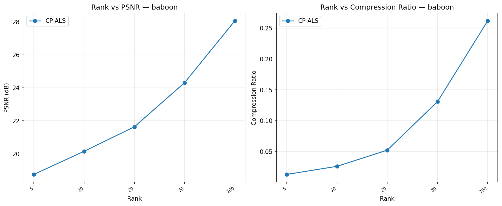
*Figure A1. CP rank sweep on Baboon*

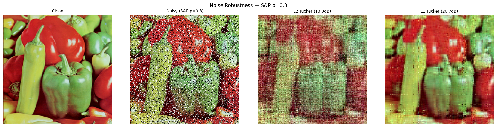
*Figure A2. Reconstruction under Salt & Pepper noise (p = 0.30)*

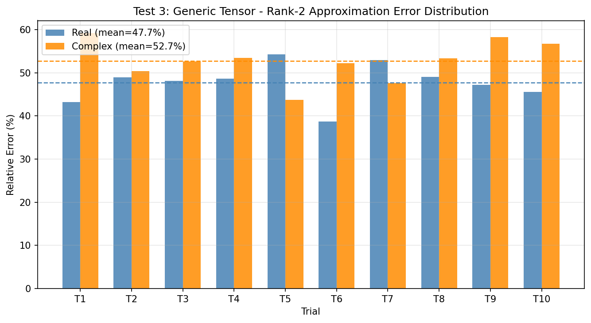
*Figure A3. Reconstruction error histogram on a generic random tensor*